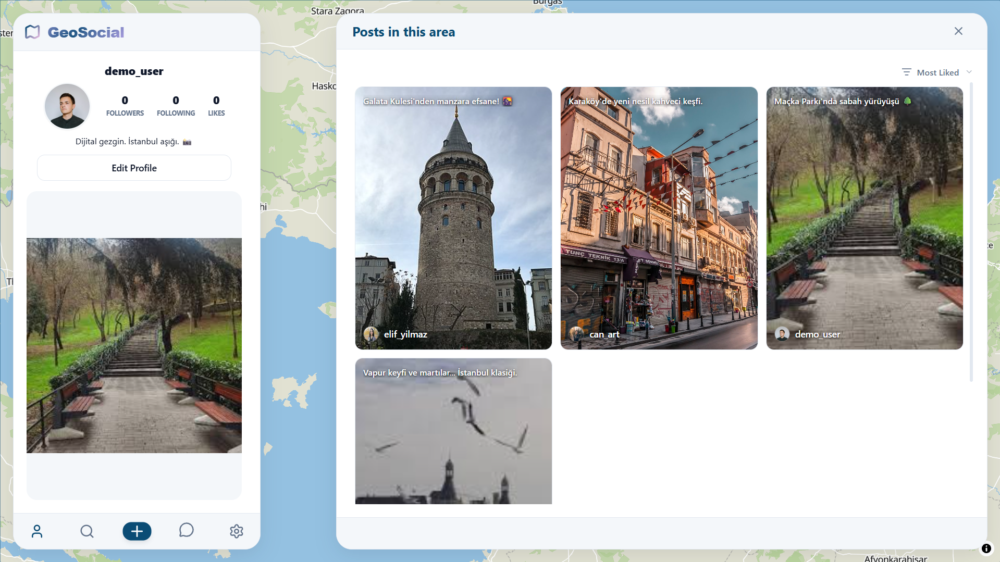
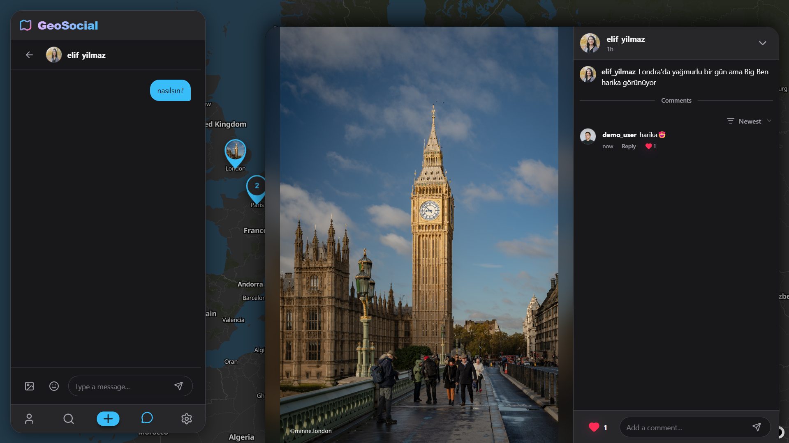
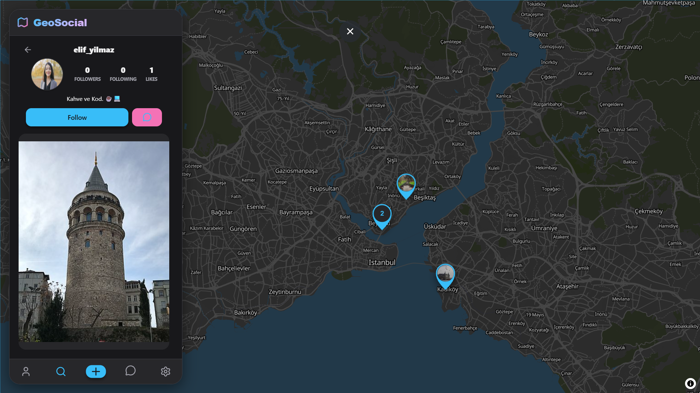

# Geosocial - Location-Based Social Media

> A modern social media platform where users can share location-based posts, interact on an interactive map, and chat in real-time.



## 🚀 Features

-   **📍 Interactive Map:** Visualize posts and users on a dynamic map using MapLibre.
-   **💬 Real-time Chat:** Instant messaging powered by Socket.io.
-   **📷 Media Sharing:** Create posts with images and descriptions.
-   **🔐 Authentication:** Secure user authentication with JWT.
-   **🎨 Modern UI:** Built with React and TailwindCSS.

## 🛠️ Tech Stack

-   **Frontend:** React, Vite, TailwindCSS, Zustand, MapLibre GL
-   **Backend:** Node.js, Express, MongoDB, Socket.io
-   **Database:** MongoDB

## 📸 Screenshots

| Post Feed | Map View |
|-----------|----------|
|  |  |


## ⚙️ Getting Started

Follow these steps to set up the project locally.

### 1. Clone the Repository

```bash
git clone https://github.com/gokhanbay05/geosocial.git
cd geosocial
```

### 2. Backend Setup

```bash
cd backend
npm install
```

**Configuration:**
Create a `.env` file in the `backend` folder and add the following variables:

```properties
PORT=5000
MONGO_URI=your_mongodb_connection_string
JWT_SECRET=your_secret_key
CLIENT_URL=http://localhost:5173
COOKIE_NAME=geosocial_token
NODE_ENV=development
```

**Seed Data (Optional):**
Populate the database with sample users and posts:

```bash
npm run seed
```

**Start Server:**

```bash
npm start
```

### 3. Frontend Setup

Open a new terminal:

```bash
cd frontend
npm install
```

**Configuration:**
Create a `.env` file in the `frontend` folder and add the following variables. (Note: You need a free API key from MapTiler)

```properties
VITE_API_URL=http://localhost:5000/api
VITE_SOCKET_URL=http://localhost:5000
VITE_MAPTILER_KEY=your_maptiler_api_key
```

**Start App:**

```bash
npm run dev
```

Visit `http://localhost:5173` to view the app.

### 4. Demo Credentials

To explore the application with pre-loaded data, you can use the following demo account:

-   **Email:** `demo@geosocial.com`
-   **Password:** `password123`

_Note: You can also create a new account via the Sign Up page._
